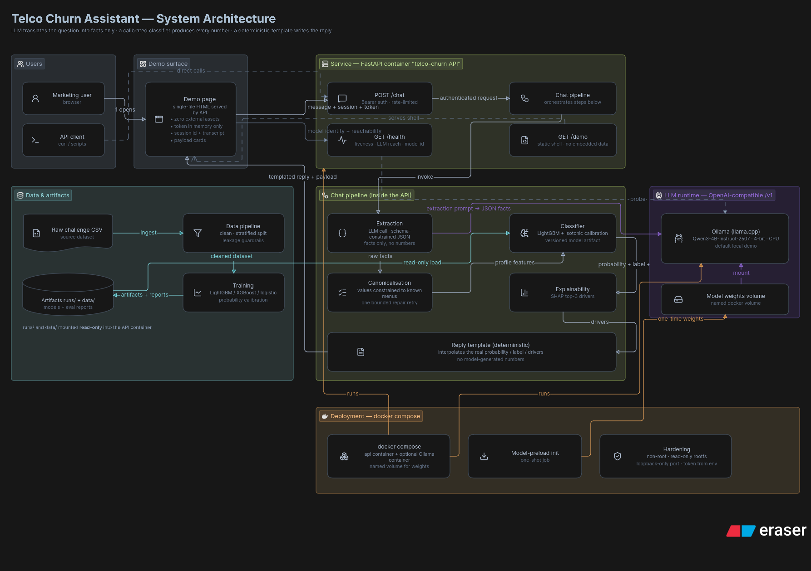
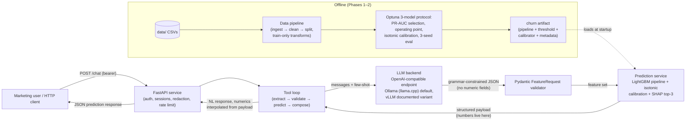
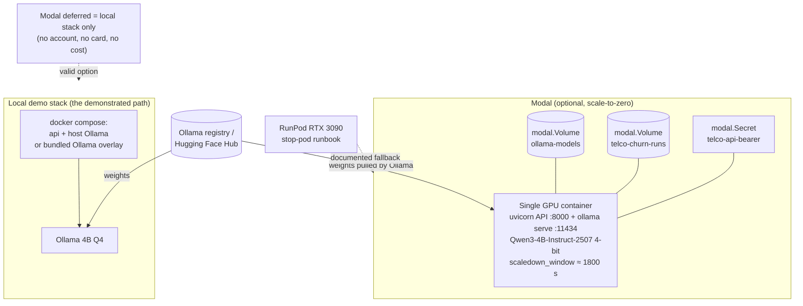
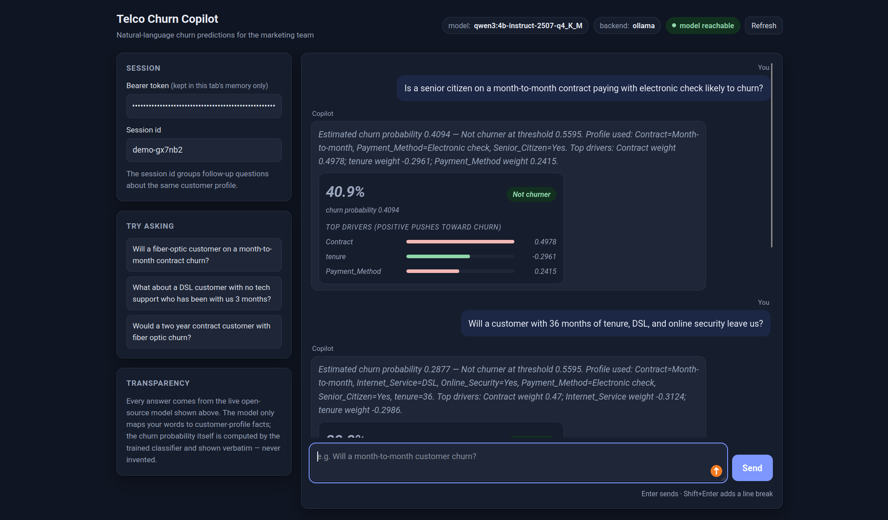
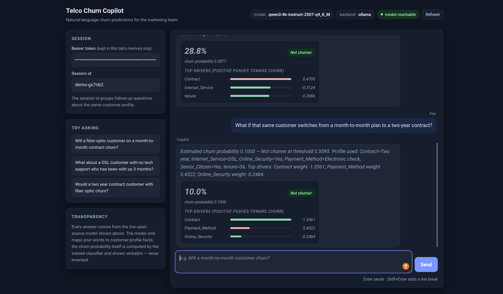

<div align="center">

# 🛰️ Telco Churn Assistant

**Ask churn questions in plain English — a small open-source LLM translates, a calibrated classifier answers with real numbers.**

[](https://www.python.org/)
[](https://fastapi.tiangolo.com/)
[](https://ollama.com/library/qwen3)
[](#-tests--quality)
[](#-tests--quality)
[](#-repository-layout)

[Architecture](#-architecture) · [Quickstart](#-quickstart) · [Demo](#-see-it-in-action) · [API](#-use-the-api) · [Docs](#-documentation-map)

</div>

---

<div align="center">
  
  <br><sub><i>End-to-end architecture (diagram exported from Eraser) — rationale in <a href="#-architecture">Architecture</a>.</i></sub>
</div>

## ✨ What this is

Built for the **IBM Telco (Etisalat) data-science challenge**: a marketing team asks churn
questions in natural language, an open-source LLM converts each question into a
**schema-validated feature request**, and a gradient-boosting classifier computes the
churn probability — with the top-3 SHAP drivers and the model identity shown on every answer.

> **🧭 The extract-only guarantee** — the LLM's only channel into the system is the closed
> `FeatureRequest` schema (feature names + filters, **no numeric fields**). Every number in an
> answer is interpolated from the classifier's prediction payload. The LLM never generates,
> transforms, or hallucinates numbers — it only translates language into facts.

| Phase | Capability | Where |
| --- | --- | --- |
| 1 | **Data pipeline** — ingest → clean → stratified split, leakage guardrails | `src/telco_churn/data/` |
| 2 | **Churn model** — Optuna-tuned logistic / XGBoost / LightGBM, operating point (F1-max @ precision ≥ 0.55), isotonic calibration, SHAP top-3 drivers, 3-seed eval in the honest AUC band **0.84–0.88** | `src/telco_churn/model/` |
| 3 | **Chat pipeline** — extract-only LLM, grammar-constrained JSON, canonicalisation + bounded repair, sessions, PII redaction, refusals | `src/telco_churn/chat/` |
| 4 | **Chat API** — `POST /chat`, `GET /health`, `GET /demo`, bearer auth, structured error contract, rate limiting, OWASP checklist | `src/telco_churn/api/` |
| 5 | **Deployment** — local compose stack (host Ollama default), optional bundled-LLM overlay, single-container Modal GPU function (ready, not exercised), RunPod fallback runbook | `deploy/` |

## 🏗️ Architecture

**One self-contained Python project. One FastAPI service. One LLM runtime seam.**
No Kubernetes, no microservices, no message queues, no second frontend host — the demo page is a
single static HTML file served by the same FastAPI process.



**Key invariant:** the LLM's only channel into the system is the schema-constrained
`FeatureRequest` (feature names + filters, **no numeric fields**). Every number in a chat
response is interpolated from the prediction payload — the LLM never generates or transforms numbers.

### Module seams

| Seam | Contract | Consumers |
| --- | --- | --- |
| `data.ingest` / `data.clean` / `data.split` | polars frame in → cleaned frame / seeded splits out | training, chat baseline profile |
| `model.artifact` (`ChurnArtifact`) | joblib object + meta sidecar; `predict_proba`, `calibrated_proba`, `feature_names` | chat loop, artifact reload checks |
| `chat.loop.ChurnChatPipeline.handle` | text in → `TurnReply{text, payload}` out; refusal paths return `payload=None` | API `/chat` |
| `serving.llm_client.LlmClient` | OpenAI-compatible `/chat/completions` with JSON-schema `response_format` | chat loop only (one seam) |
| `api.app.create_app` | factory; every dependency injectable for tests | uvicorn `--factory`, TestClient |

### Control planes

- **Auth** — single bearer token from env (`TELCO_API_BEARER_TOKEN`), `hmac.compare_digest`, fail-fast on missing/short tokens.
- **Errors** — one stable JSON shape `{"error": {"code", "message"}}`; details withheld from clients, stack traces stay in server logs.
- **Rate limiting** — in-process fixed window per token (default 60 calls / 3600 s), `429` with `Retry-After`.
- **PII hygiene** — emails / phones / customer-ID patterns redacted before any log persistence.
- **Model honesty** — published AUC band 0.84–0.88; any result above the band triggers the documented leakage-audit gate before being reported.

<details>
<summary><b>🚀 Deployment topologies (click to expand)</b></summary>



- **Adopted runtime (ADR-0001 amendment):** Ollama (llama.cpp) + Qwen3-4B-Instruct-2507 4-bit in the *same* container as the API on Modal T4/L4, weights cached in a Modal Volume. Zero code change vs local — only `TELCO_LLM_BASE_URL` differs.
- **vLLM variant:** documented-only; adopted if a demo ever needs concurrent multi-user serving (batching matters under concurrency, not for a single-user extraction turn).
- **Deferral:** Modal is optional. With no account there is no card and no cost; the local compose stack is the demonstration path.
- **RunPod fallback:** per-hour community RTX 3090, stop-pod storage-preserving pattern (~$0.22/h running, $0 stopped) — see `docs/runpod-fallback.md`.

</details>

<details>
<summary><b>📦 Repository layout (click to expand)</b></summary>

```text
etisalat-use-case/
├── src/telco_churn/
│   ├── config.py                     # env-driven settings (token, LLM base URL, model id…)
│   ├── data/                         # ingest → clean → split (Phase 1)
│   ├── model/                        # pipelines, Optuna tuning, operating point, calibration,
│   │                                 #   SHAP, artifacts, external validation (Phase 2)
│   ├── chat/                         # FeatureRequest schema, prompts, tool loop,
│   │                                 #   sessions, PII redaction (Phase 3)
│   ├── serving/llm_client.py         # the ONLY OpenAI-compatible LLM seam
│   └── api/
│       ├── app.py                    # /chat + /health + /demo (+ auth, errors, rate limit)
│       └── static/demo.html          # self-contained demo page (inline CSS/JS, zero external assets)
├── deploy/
│   ├── Dockerfile (+ Dockerfile.dockerignore)
│   ├── docker-compose.yml            # api container + host Ollama (default: zero downloads)
│   ├── docker-compose.bundled-llm.yml# optional overlay: own Ollama + model-init + weights volume
│   └── modal_app.py                  # single-container GPU function (ready, not exercised)
├── data/                             # challenge CSV + cleaned CSV
├── runs/                             # trained artifacts (*.joblib) + evaluation reports
├── tests/{unit,eval,integration}/    # hermetic units + gated live-model eval suites
├── docs/                             # ADRs, guides, perf report, ops log, img/
└── openspec/                         # specs/ (6 capabilities) + changes/archive/ (frozen history)
```

</details>

## ⚡ Quickstart

### ✅ Before you start — the model

The default stack uses **Ollama on your machine** (no multi-GB download from the repo side).
Make sure the exact model is available:

```sh
ollama list | grep qwen3:4b-instruct-2507-q4_K_M
```

If that prints nothing, pull the weights once (~2.5 GB):

```sh
ollama pull qwen3:4b-instruct-2507-q4_K_M
```

<sub>Prefer zero host setup? **Path B** below pulls the same weights into a Docker volume instead — no local Ollama install needed.</sub>

### Path A — one command (API in Docker, LLM on your host) ⭐

```sh
cp .env.example .env                      # then set a real TELCO_API_BEARER_TOKEN (≥ 8 chars)
docker compose -f deploy/docker-compose.yml up -d --build
```

The stack reaches your host Ollama via `host.docker.internal:11434`, so **no model downloads
happen inside Docker**. The API binds to loopback only (`127.0.0.1:8000`).

### Path B — fully containerized LLM (bundled overlay)

No local Ollama? Layer the bundled overlay — it adds its own Ollama container plus a one-shot
`model-init` that pulls `qwen3:4b-instruct-2507-q4_K_M` into a persistent named volume
(`telco-churn-ollama-models`). Multi-GB one-time download; later runs are delta-safe.
The Ollama port stays unpublished (host-native Ollama keeps `:11434`).

```sh
docker compose -f deploy/docker-compose.yml -f deploy/docker-compose.bundled-llm.yml up -d --build
```

### Path C — bare metal (no Docker)

```sh
uv sync                                   # create .venv
# train (optional — artifacts ship in runs/):
PYTHONPATH=src .venv/bin/python -m telco_churn.model.train --n-trials 20
# serve:
TELCO_API_BEARER_TOKEN=local-demo-token \
.venv/bin/python -m uvicorn telco_churn.api.app:create_app --factory --host 0.0.0.0 --port 8000
```

### Then check it's alive

```sh
curl -s http://127.0.0.1:8000/health
# → {"service":"ok","llm":"reachable","llm_model":"qwen3:4b-instruct-2507-q4_K_M","llm_backend":"ollama"}
```

Open **http://127.0.0.1:8000/demo**, paste the token from `.env`, and ask away. 🎉

## 🖼️ See it in action

| Live answer from the demo page | Same-session follow-up |
| --- | --- |
|  |  |

**How to read an answer:**

- **Churn probability** + the operating threshold (calibrated, F1-max @ precision ≥ 0.55)
- **Label** — *Churner* / *Not churner* at that threshold
- **Top-3 drivers** — SHAP contributions for the profile that was actually used
- **Profile used** — exactly the facts extracted from your question (nothing invented)
- **Model identity** — the header shows the answering model + backend from `GET /health`

## 🔌 Use the API

`GET /health` is open; every other call needs the bearer header (read the token from
`.env` — it is not exported into your shell):

```sh
TOKEN=$(grep -E '^TELCO_API_BEARER_TOKEN=' .env | cut -d= -f2- | tr -d '"')
curl -s http://127.0.0.1:8000/health
curl -s -X POST http://127.0.0.1:8000/chat \
  -H "Authorization: Bearer ${TOKEN}" \
  -H "Content-Type: application/json" \
  -d '{"session_id": "s1", "message": "Will a fiber-optic customer on a month-to-month contract churn?"}'
```

The reply carries a human-readable text plus the structured payload
(`churn_probability`, `churn_label`, `drivers`). Follow-up questions in the same `session_id`
accumulate facts; errors use the stable `{"error": {"code", "message"}}` contract
(`401`, `429`, `400`, `500`).

## 🤖 The model & transparency

- **Served model:** `qwen3:4b-instruct-2507-q4_K_M` (4-bit, Apache-2.0) served by Ollama (llama.cpp)
  — CPU-friendly; the first answer after a cold start takes 20–90 s, then turns are seconds.
- **No mocks on any served path:** the demo page, the API, and the smoke check always resolve the
  real configured backend (`TELCO_LLM_BASE_URL`); deterministic test doubles exist only inside
  unit tests.
- **Identity is visible:** `GET /health` (and the demo header) reports the configured model and
  backend, so a silent runtime swap would be immediately visible.
- **Gated live smoke:** `tests/eval/test_demo_smoke.py` performs one real authenticated turn and
  records model identity, backend, latency, and schema validity into `runs/demo_smoke_report.json`.

## 🧪 Tests & quality

```sh
.venv/bin/python -m pytest -q        # 103 passed, zero warnings (unit + gated live eval)
uv run pre-commit run --all-files    # ruff · mypy · bandit · gitleaks · … (12 hooks)
```

- Hermetic unit tests run GPU-less and LLM-less (deterministic doubles, confined to tests).
- Live-model eval suites (`tests/eval/`) are opt-in via the `eval_llm` marker and skip cleanly
  when no local Ollama endpoint is reachable.
- Extraction quality is measured against a curated 23-case suite (schema validity 1.0, slot
  accuracy 1.0 on the served model) — report in `runs/extraction_suite_report.json`.

## 📚 Documentation map

- `docs/chatbot-usage.md` — how the marketing team uses the chatbot (challenge deliverable 2.c)
- `docs/perf-report.md` — measured latency budgets (CPU baseline; GPU procedure)
- `docs/security-checklist.md` — OWASP API Security Top 10 (2023) audit
- `docs/ops-log.md` — deployment operations record (defects, incidents, verifications)
- `docs/runpod-fallback.md` — RTX 3090 stop-pod fallback runbook
- `docs/adr/` — architecture decisions (Modal serverless; extract-only grammar-constrained LLM)
- `docs/phase*-doc.md` — per-phase implementation rationale
- `openspec/specs/telco-churn/` — the six capability specs (data pipeline, churn model, chat
  pipeline, chat API, demo surface, deployment); frozen change history in `openspec/changes/archive/`

## License & scope

Open-source-licensed models only (Qwen3, Apache-2.0). Single-service deployment by design —
no Kubernetes, no queues, no second frontend host. Secrets live in `.env` (gitignored) and are
never baked into images or the demo page.

<div align="center"><sub>FastAPI · Ollama · LightGBM · SHAP · OpenSpec — built as a working PoC, not a slide deck.</sub></div>
