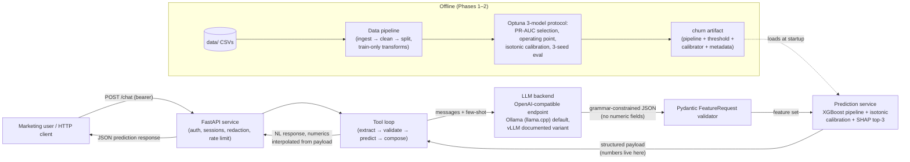
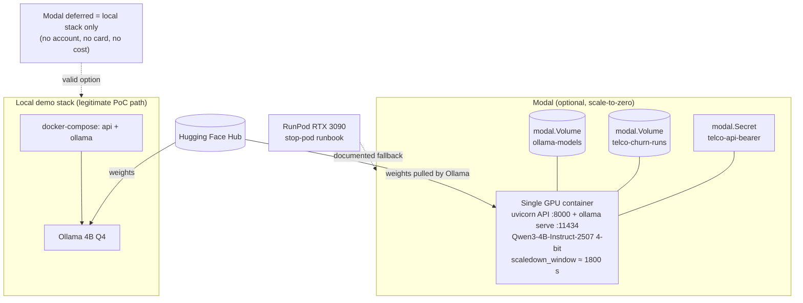

# Architecture — telco-churn

> Deliverable 3 of the challenge: a diagram of the architecture and data flow, with the full rationale recorded in `docs/phase*-docs` and the decision ledger in the OpenSpec change.

## 1. System shape

One self-contained Python project. One FastAPI service. One LLM runtime seam.

```text
etisalat-use-case/
├── src/telco_churn/
│   ├── config.py               # env-driven settings (LLM base URL, model id, bearer token)
│   ├── data/                   # ingest → clean → split (Phase 1)
│   ├── model/                  # pipelines, optuna tuning, operating point, calibration, SHAP, artifact, external validation (Phase 2)
│   ├── chat/                   # FeatureRequest schema, prompts, tool loop, sessions, PII redaction (Phase 3)
│   ├── serving/llm_client.py   # the ONLY OpenAI-compatible LLM seam
│   └── api/                    # /chat + /health + auth + errors + rate limiting (Phase 4)
├── deploy/
│   ├── modal_app.py            # single-container GPU function: API + Ollama, scale-to-zero
│   ├── docker-compose.yml      # local stack: api + ollama
│   ├── Dockerfile / .dockerignore
│   └── runpod-fallback.md      # RTX 3090 stop-pod runbook
├── tests/{unit,eval,integration}/
├── data/                       # challenge CSV + cleaned CSV (weights-free)
└── docs/                       # this file, ADRs, checklists, perf report, ops log
```

No Kubernetes, no microservices, no message queues, no second frontend host. The demo page (`/demo`, add-demo-surface change) is a single static HTML file served by the same FastAPI process.

## 2. Data flow



Key invariant: the LLM's only channel into the system is the schema-constrained `FeatureRequest` (feature names + filters, **no numeric fields**). Every number in a chat response is interpolated from the prediction payload computed by the classifier — the LLM never generates or transforms numbers.

## 3. Deployment topologies



- **Adopted runtime (ADR-0001 amendment):** Ollama (llama.cpp) + Qwen3-4B-Instruct-2507 4-bit in the *same* container as the API on Modal T4/L4, weights cached in a Modal Volume. Zero code change vs local — only `TELCO_LLM_BASE_URL` differs.
- **vLLM variant:** documented-only; adopted if the demo ever needs concurrent multi-user serving (batching matters under concurrency, not for a single-user ~50-token extraction turn).
- **Deferral:** Modal is optional. With no account there is no card and no cost; the local compose stack is the demonstration path.
- **RunPod fallback:** per-hour community RTX 3090, stop-pod storage-preserving pattern (~$0.22/h running, $0 stopped).

## 4. Module seams

| Seam | Contract | Consumers |
| --- | --- | --- |
| `data.clean` / `data.ingest` / `data.split` | polars frame in → cleaned frame / seeded splits out | training, chat baseline profile |
| `model.artifact` (`ChurnArtifact`) | joblib object + meta sidecar; `predict_proba`, `calibrated_proba`, `feature_names` | chat loop, artifact reload checks |
| `chat.loop.ChurnChatPipeline.handle` | text in → `TurnReply{text, payload}` out; refusal paths return `payload=None` | API `/chat` |
| `serving.llm_client.LlmClient` | OpenAI-compatible `/chat/completions` with JSON-schema `response_format` | chat loop only (one seam) |
| `api.app.create_app` | factory; every dependency injectable for tests | uvicorn `--factory`, TestClient |

## 5. Control planes

- **Auth:** single bearer token from env (`TELCO_API_BEARER_TOKEN`), `hmac.compare_digest` comparison, fail-fast min length 8.
- **Errors:** one stable JSON shape `{error: {code, message}}` from global handlers; details withheld from clients, stack traces stay in server logs.
- **Rate limiting:** in-process fixed sliding window per token (60 calls / 3600 s default), `429` with `Retry-After`.
- **PII hygiene:** emails / phones / customer-ID patterns redacted before any log persistence.
- **Model honesty:** published AUC band 0.84–0.88; any result above the band triggers the documented leakage audit gate before being reported.

## 6. References

- Decision ledger: `openspec/changes/add-telco-churn-poc/design.md` (D1–D14), ADRs in `docs/adr/`
- Capability specs: `openspec/changes/add-telco-churn-poc/specs/telco-churn/{data-pipeline,churn-model,chat-pipeline,chat-api,deployment}/spec.md`
- Ops history: `docs/ops-log.md`
