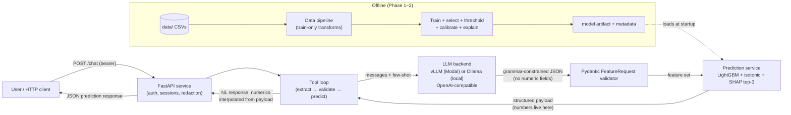
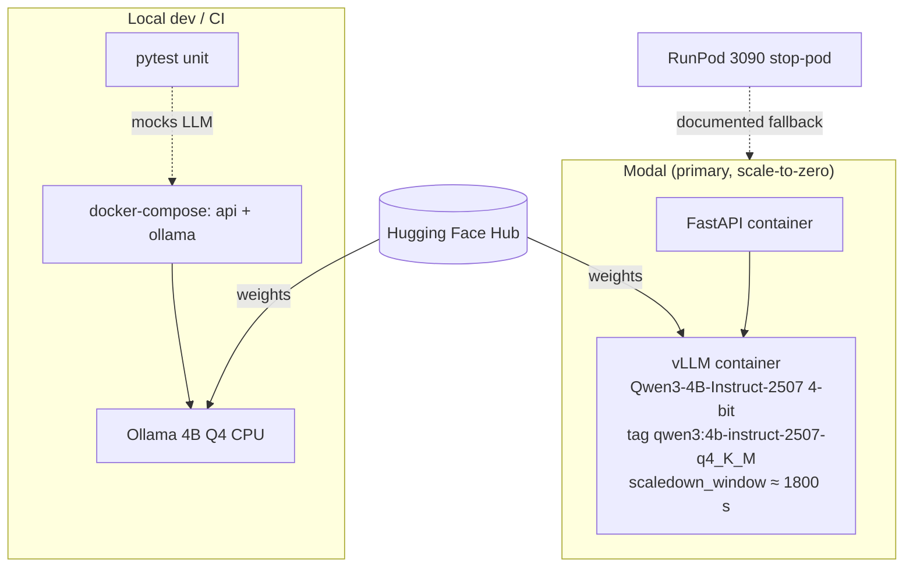

# Design — add-telco-churn-poc

## Context

Greenfield build under `etisalat-use-case/`. Motivation and constraints are in proposal.md (challenge PDF, $0–20 budget, no local GPU, open-source-only LLMs). The decision ledger D1–D14 is locked (ADR-0001: Modal serverless over free-tier VMs; ADR-0002: extract-only grammar-constrained LLM, no fine-tuning). This document explains the how: system shape, component responsibilities, and the technical choices behind them. Behavior requirements live in the five capability specs.

## Goals / Non-Goals

**Goals:**

- One self-contained Python project (`etisalat-use-case/`) that trains the churn model, serves the chat API, and deploys to Modal with local-parity dev.
- A single LLM integration seam: every runtime (vLLM on Modal, Ollama locally, mocked in CI) speaks the same OpenAI-compatible protocol behind one client class.
- Eval artifacts that make the honest-band claims reproducible and auditable (fixed seeds, reported protocol, leakage guardrails built into the pipeline objects).

**Non-Goals:**

- No Kubernetes, no microservices, no message queues — one FastAPI service + one LLM runtime.
- No LLM fine-tuning, no agent frameworks (LangChain et al.), no DL tabular models.
- No persistent storage beyond the model artifact + light MLflow tracking; sessions are in-memory.
- No multi-tenant auth system — single bearer token from environment.

## Decisions

### D-A. System shape: single FastAPI service, layered internally

```
etisalat-use-case/
├── pyproject.toml              # uv-managed; deps per proposal
├── README.md
├── data/                       # telco CSV + external validation CSVs (git-ignored weights-free)
├── docs/                       # mismatches.md, security-checklist.md, perf-report.md, architecture.md
├── deploy/
│   ├── modal_app.py            # Modal App: API + vLLM containers, scaledown_window
│   ├── docker-compose.yml      # local stack: api + ollama
│   └── runpod-fallback.md      # stop-pod runbook
├── src/telco_churn/
│   ├── config.py               # env-driven settings (LLM base URL, model id, auth token)
│   ├── data/
│   │   ├── ingest.py           # CSV load, header trim, customerID drop
│   │   ├── clean.py            # Total_Charges coercion, sentinel normalization, avg_monthly
│   │   └── split.py            # stratified 80/20 + fold builder (seeded)
│   ├── model/
│   │   ├── train.py            # sklearn Pipeline wrappers: logreg / XGB / LGBM + train-only resampling
│   │   ├── select.py           # Optuna per-model; selection by mean CV PR-AUC
│   │   ├── threshold.py        # F1-max @ precision ≥ 0.55 from train CV
│   │   ├── calibrate.py        # isotonic, fitted on train folds
│   │   ├── explain.py          # SHAP TreeExplainer → top-3 drivers
│   │   └── evaluate.py         # 3-seed mean±std reporting, external validation runner
│   ├── chat/
│   │   ├── schemas.py          # FeatureRequest Pydantic model (no numeric fields)
│   │   ├── prompts.py          # extraction prompt + few-shot examples
│   │   ├── loop.py             # ~150-line tool loop (extract → validate → predict → compose)
│   │   ├── session.py          # in-memory session store
│   │   └── redact.py           # PII scrubber for logs
│   ├── serving/
│   │   └── llm_client.py       # OpenAI-compatible client; guided_json via response_format
│   └── api/
│       ├── app.py              # FastAPI wiring: /chat, /health, auth dependency, error handler
│       └── errors.py           # stable JSON error contract
└── tests/
    ├── unit/                   # mocks the LLM; runs in plain CI
    ├── eval/                   # extraction suite + model eval (LLM-backed, opt-in)
    └── integration/            # Ollama-gated end-to-end
```

Rationale: the spec's simplicity clause (§6) and a 1-user demo rule out distributed layers; a single process with clean module seams keeps every spec requirement locally testable. Alternatives: (a) microservices — rejected, no scale need, costs cold-start latency; (b) monorepo-wide shared lib — rejected, this repo is a wiki, the project must stay self-contained.

### D-B. Architecture flow





### D-C. The only LLM→system channel is the schema-constrained JSON request

The loop asks the LLM for a feature-selection object and enforces it with grammar-based decoding (`response_format`/`guided_json` with a JSON schema compiled from the Pydantic `FeatureRequest`). The schema deliberately contains **no numeric fields** — numeric extraction is a footgun (the challenge's core risk), and feature *names* are all the tool needs. The validator accepts values only from the closed feature-name enum, so an LLM cannot introduce columns that don't exist.

Why not native function calling? BFCL v4 gaps between candidate models (8B 42.6% vs 4B-2507 35.7%) would push the model choice; grammar-constrained output makes the 4B deterministic at the parser level and neutralizes that gap (ADR-0002). Why not let the LLM write the answer? "LLM never generates numbers" (locked): the loop's response template interpolates numerics from the prediction payload; the LLM supplies only the human-readable wrapper text and the final restatement is assembled by code.

### D-D. One client seam across runtimes

`serving/llm_client.py` wraps an OpenAI-compatible chat endpoint. `config.yaml`/env chooses base URL + model: `http://vllm:8000/v1` on Modal, `http://localhost:11434/v1` locally, a fake transport in unit tests. No other module imports a provider SDK. This is what makes D8 (hybrid dev) cheap: unit tests run GPU-less, integration runs on local Ollama, demos run on Modal — same code path.

### E. Model protocol (offline)

- Three candidates share one protocol object: logistic baseline, XGBoost, LightGBM. Imbalance handling (class weighting / SMOTE) lives **inside** the sklearn Pipeline so it fits on train folds only.
- Selection metric: mean 5-fold PR-AUC on the 80% train portion; all three models' scores are reported regardless of winner.
- Operating point: threshold = F1(churn)-maximizing on train CV subject to precision ≥ 0.55; recalculated per seed, reported mean±std.
- Calibration: isotonic map fitted on train-folds' out-of-fold predictions; chat responses show calibrated probability.
- Explanation: SHAP `TreeExplainer` top-3 drivers per prediction into the API payload.
- Evaluation: metrics = mean±std over 3 seeds; test set touched at most once per seed; any result above the published band (AUC > 0.88) triggers the documented leakage audit before claiming.
- Artifacts: model + calibrator + threshold + feature list + seed/config metadata saved so AUC is reproducible ±0.01; MLflow logs runs lightly (params + metrics, no artifact server).
- Data engineering: `Total_Charges` coerced before split; 11 blank tenure-0 rows get a documented rule; `avg_monthly = Total_Charges / tenure` engineered where meaningful; categorical variants trimmed; sentinel strings ("No phone service" / "No internet service") kept distinct from plain "No"; 0/1 `Senior_Citizen` → bool.
- External validation: the frozen artifact is evaluated zero-shot with minimal schema mapping on UCI Iranian Churn and Orange Telecom; the honest AUC drop is reported. CTGAN output is used for sensitivity ablation and demo filler only — never presented as validation evidence (D3).

### F. API surface discipline

`POST /chat` + `GET /health` only. Bearer token from env (fail-fast at startup if unset). Errors: one stable JSON shape (`error.code`, `error.message`), produced by a global exception handler; stack traces stay in server logs. Logging goes through the redaction scrubber (emails, phones, customer-ID patterns) before persistence. Sessions: `dict[session_id, SessionState]` in-process — single-instance deployment makes this correct without Redis; a restart clears sessions and the client starts a new one (documented).

### G. Serving configuration (ADR-0001)

Modal app defines two functions: the FastAPI web endpoint (scale-to-zero) and a vLLM container (image with pinned `vllm` + `transformers` versions, model downloaded from HF at build/cold-start, 4-bit checkpoint). `scaledown_window=1800` during demo windows so consecutive turns never pay cold start. Local: docker-compose runs `api` + `ollama` (official arm64/x86 image), model pulled on first run. RunPod fallback is a runbook only — same image, stop-pod storage pattern.

## Risks / Trade-offs

- [4B extraction quality below 95% slot bar] → Documented one-config swap to Qwen3-8B (spec'd); extraction suite is the gate in Phase 3, not an afterthought.
- [Modal cold start > 3 min or demo stall] → `scaledown_window ≈ 1800 s` during demo windows; cold-start measurement recorded in perf report; RunPod warm-pod fallback runbook.
- [Above-band AUC tempting to report] → Eval protocol hardcodes the band check; above-band results trigger the leakage audit and are disclosed with protocol notes (D2/D9).
- [Test-set contamination through iteration] → Test touched ≤ once per seed, scripted; CV + threshold + calibration all fitted inside train-fold pipelines.
- [sklearn ↔ Polars edge cases] → Polars owns ingestion; a single `to_pandas()` boundary converts to pandas/numpy at the model fit seam — no mid-pipeline engine mixing.
- [vLLM/model version drift on Modal] → Pinned versions in the deploy image; stale-flag notes say re-verify Qwen support and Modal rates at deploy time.
- [In-memory sessions lost on restart] → Single-instance deployment makes restarts rare and sessions documented as session-scoped; clients recover by starting a new session.
- [PII in model inputs (customerID, IDs in free text)] → customerID dropped at ingest; redaction runs before any log persistence; no raw request bodies persisted.

## Migration Plan

Greenfield — no migration. Deployment sequence: Phase 0 scaffold → 1 data pipeline → 2 model + eval → 3 chat pipeline + extraction suite → 4 API + security checklist + local compose → 5 Modal deploy + perf measurement + docs + runbook. Rollback: Modal keeps the previous deployment revision; `modal deploy` rollback is a redeploy of the prior tag. No rollback path needed for the repo (append-only wiki log; project tree is additive).

## Open Questions

- Modal's exact GPU class availability in the chosen region at deploy time (T4 vs L4) — a deploy-time check; either satisfies the VRAM budget.
- Final bearer-token distribution to the client (env value now; distribution mechanism is the client's operational concern).
